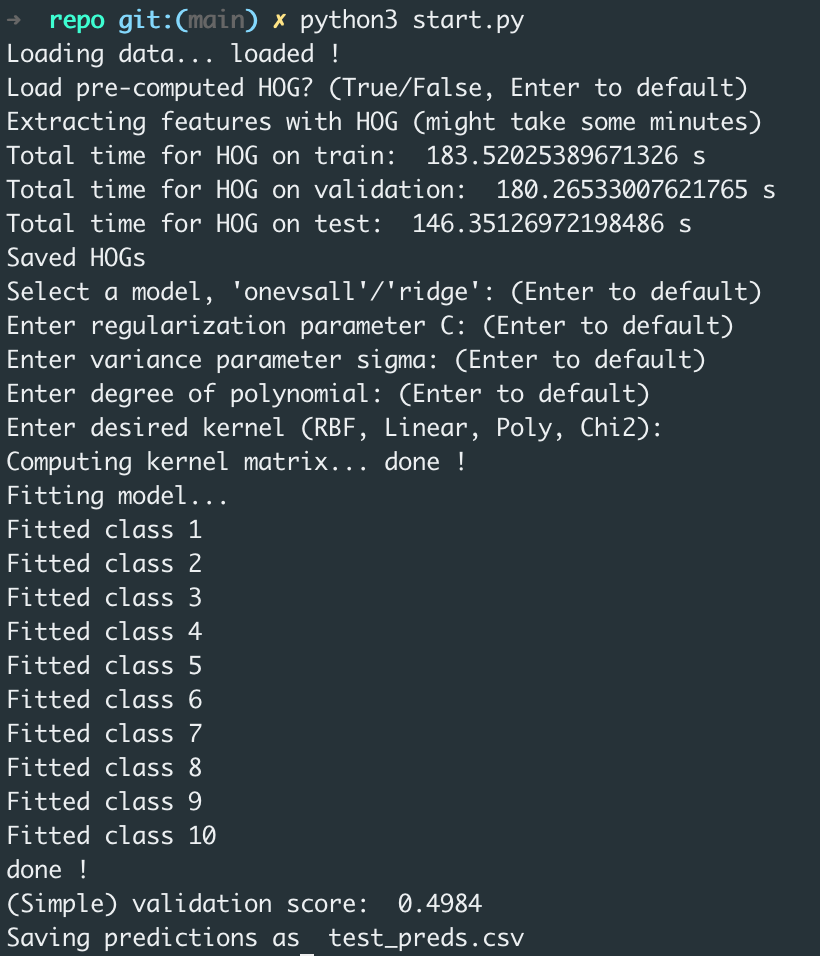

# Image classification with kernel methods

This repo contains our implementation done concerning the data challenge for the
course on Kernel Methods at the master MVA. The objective was to classify images 
from a subset of the CIFAR-10 dataset using exclusively kernel methods and our 
own code, i.e., without the aid of libraries such as libsvm or sklearn. 

To test our methods simply run ```start.py```. If you press enter at all 
prompts you will recover an "one vs. all" SVM with C=10, RBF kernel of unit
variance, trained on half the data. This gives us roughly 50% accuracy.

A report explaining our approaches, results, and also containing useful 
references is available in ```report.pdf```.

*P.s.* Some useful comments. If for some reason you are experiencing low 
accuracy, try recalculating the HOG descriptors instead of using the 
pre-computed versions. Also, beware that the Chi2 kernel can be computationally
demanding and take a while to predict/provide validation scores.


